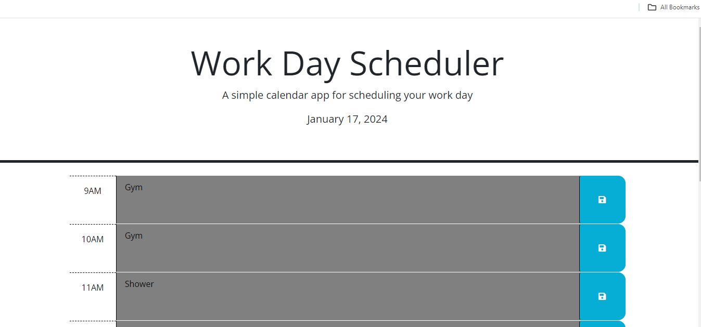
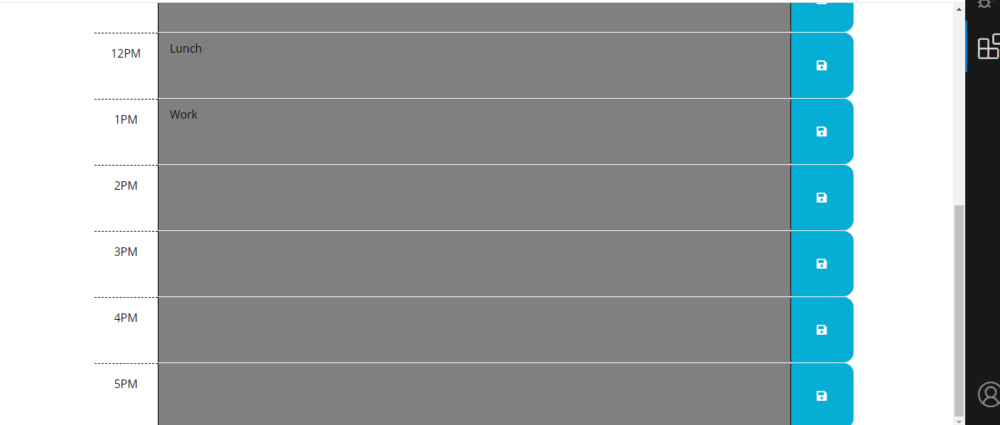

# Work Day Scheduler

## Description

### What was your motivation?
- The motivation behind building this calendar application stems fom addressing the needs of busy employees who seek an efficient way to manage their daily schedules.

### Why did you build this project?
- As I mentioned before, to address the needs of busy employees who require an efficent and friendly tool for managing their daily schedules.

### What problem does it solve?
- This project solves the problem of effective time management for busy employees. it provides a practical solution for individuals to organize and prioritize their tasks during standard business hours(9am-5pm). The color-coded timeblocks visually indicate whether an event is in the past, present or future, aiding users in quickly identifying and managing their schedule.

### What did I learn from it?
- Through this project, I gained valuable hands-on experience in developing dynamic and responsive web applications. I learned how to use HTML, CSS and jQuery to create a user-friendly calendar application. Implementing features such as displaying the current current day, color-coding timeblocks and integrating local storage for persistent data enhanced my skills in front development.

## Table of Contents 

- [Installation](#installation)
- [Usage](#usage)
- [Credits](#credits)
- [License](#license)

## Installation

N/A

## Usage

## Credits

- [Joseph Daza]

Feel free to customize this section with any additional collaborators, third-party assets, or tutorials you utilized.

## Badges

Badges aren't necessary, per se, but they demonstrate street cred. Badges let other developers know that you know what you're doing. Check out the badges hosted by [shields.io](https://shields.io/). You may not understand what they all represent now, but you will in time.
